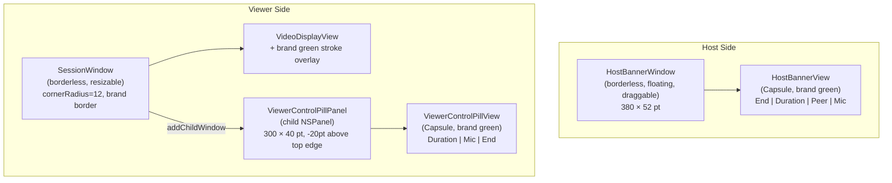

# Modern Session UI Redesign

## Brand Color

Define a single brand color — vivid pear green: `Color(red: 0.18, green: 0.95, blue: 0.45)` / `NSColor(red: 0.18, green: 0.95, blue: 0.45, alpha: 1)`. Used as the border on the viewer window and background tint on both control elements.

---

## Host Side: Floating Banner

**New file: `[HostBannerView.swift](clients/macos/PearShare/UI/HostBannerView.swift)`**

A slim, pill-shaped SwiftUI view backed by a draggable `NSWindow`:

- Window: `styleMask: [.borderless]`, `level = .floating`, `isMovableByWindowBackground = true`, `hasShadow = true`
- Size: ~380 × 52 pt, centered near the bottom of the screen on launch
- Shape: `Capsule()` filled with brand green at ~90% opacity + a very slight material blur
- Content (left → right): red end-call button | duration timer (monospaced) | peer name | mic toggle icon
- The window replaces the full `SessionView` for the `.host` role entirely — no big window is opened

---

## Viewer Side: Borderless Window + Control Pill

### Window changes in `[AppDelegate.swift](clients/macos/PearShare/App/AppDelegate.swift)`

Replace the current session window setup for the `.viewer` role:

```swift
// Current
styleMask: [.titled, .closable, .resizable, .miniaturizable]

// New
styleMask: [.borderless, .resizable]
isMovableByWindowBackground = true
// Apply corner radius on the window's layer
contentView?.wantsLayer = true
contentView?.layer?.cornerRadius = 12
contentView?.layer?.masksToBounds = true
```

Add a child `NSPanel` for the control pill, positioned 20 pt above the top edge, centered:

```swift
let pill = ViewerControlPillWindow(session: session, peer: peer, onHangup: ...)
sessionWindow.addChildWindow(pill, ordered: .above)
// Position: x = windowMidX - 150, y = windowMaxY - 20
```

The pill follows the parent window automatically via the child window relationship. Update pill position on `NSWindowDidMoveNotification` and `NSWindowDidResizeNotification`.

### `[SessionView.swift](clients/macos/PearShare/UI/SessionView.swift)`

- Remove the host branch and the existing toolbar capsule entirely
- Viewer layout becomes: `VideoDisplayView` filling the full view with a `RoundedRectangle(cornerRadius: 12).stroke(brandColor, lineWidth: 3)` overlay
- No in-window controls

### New file: `[ViewerControlPill.swift](clients/macos/PearShare/UI/ViewerControlPill.swift)`

An `NSPanel` subclass + SwiftUI view:

- Window: `styleMask: [.borderless, .nonactivatingPanel]`, `level = .floating`, `hasShadow = true`, `backgroundColor = .clear`
- Size: 300 × 40 pt
- SwiftUI content: `Capsule()` fill with brand green at ~85% opacity + `.ultraThinMaterial`
- Content: duration timer | mic toggle | red end-call button — all slim/compact, center-aligned
- The `NSPanel` is a child of the session window so it moves with it

---

## Viewer Side: Smart Window Sizing (1:1 or Scale-to-Fit)

### How it works

The `CVPixelBuffer` delivered to the viewer already carries the host screen's native pixel dimensions. We use these to size the viewer window correctly **once, on the first decoded frame**.

### Changes to `[VideoDisplayView.swift](clients/macos/PearShare/Media/ScreenCapture/VideoDisplayView.swift)`

Add a `@Published var sourceDimensions: CGSize?` to `VideoRenderer`. Set it the first time `enqueue(pixelBuffer:)` is called:

```swift
func enqueue(pixelBuffer: CVPixelBuffer) {
    if sourceDimensions == nil {
        sourceDimensions = CGSize(
            width:  CVPixelBufferGetWidth(pixelBuffer),
            height: CVPixelBufferGetHeight(pixelBuffer)
        )
    }
    // ... existing lock/store
}
```

### Sizing logic in `[AppDelegate.swift](clients/macos/PearShare/App/AppDelegate.swift)`

Subscribe to `renderer.$sourceDimensions` after session start. On the first non-nil value:

```swift
// sourceDims is in physical pixels; convert to points
let scale = sessionWindow.backingScaleFactor  // 1.0 or 2.0
let sourcePoints = CGSize(width: sourceDims.width / scale,
                          height: sourceDims.height / scale)

// Available rect = screen minus menu bar / dock
let available = sessionWindow.screen?.visibleFrame ?? NSScreen.main!.visibleFrame

let fitsAt1x = sourcePoints.width  <= available.width
            && sourcePoints.height <= available.height

let finalSize: CGSize
if fitsAt1x {
    // 1:1 — every host pixel maps to exactly one viewer pixel
    finalSize = sourcePoints
} else {
    // Scale down uniformly to fit within visible screen
    let wScale = available.width  / sourcePoints.width
    let hScale = available.height / sourcePoints.height
    let factor = min(wScale, hScale)
    finalSize = CGSize(width: sourcePoints.width * factor,
                       height: sourcePoints.height * factor)
}

sessionWindow.setContentSize(finalSize)
sessionWindow.center()
// Lock aspect ratio so user resizes stay proportional
sessionWindow.contentAspectRatio = finalSize
```

Because `contentAspectRatio` is set and the window always starts at the correct ratio, the Metal shader's fullscreen triangle strip remains pixel-perfect — no letterboxing logic needed in the shader.

---

## File Summary

- **Create** `clients/macos/PearShare/UI/HostBannerView.swift` — host overlay window + SwiftUI banner
- **Create** `clients/macos/PearShare/UI/ViewerControlPill.swift` — viewer control pill NSPanel + SwiftUI view
- **Modify** `[SessionView.swift](clients/macos/PearShare/UI/SessionView.swift)` — remove toolbar + host branch, add brand border to viewer video
- **Modify** `[AppDelegate.swift](clients/macos/PearShare/App/AppDelegate.swift)` — host uses banner, viewer uses borderless window + child pill; smart sizing on first frame; `contentAspectRatio` lock; update `endSession()`
- **Modify** `[VideoDisplayView.swift](clients/macos/PearShare/Media/ScreenCapture/VideoDisplayView.swift)` — add `@Published sourceDimensions` to `VideoRenderer`
- **Modify** `PearShare.xcodeproj/project.pbxproj` — add two new source files

---

## Visual Architecture




